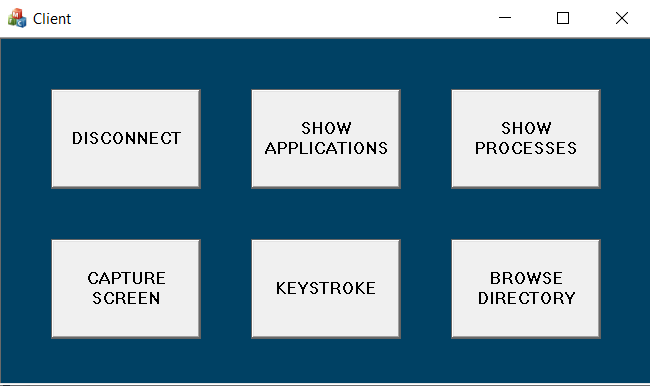
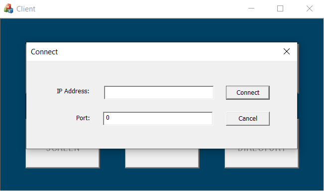
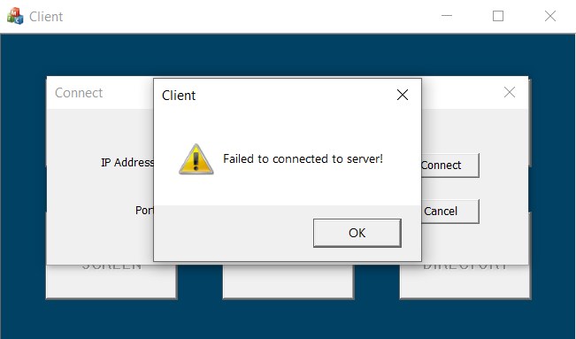
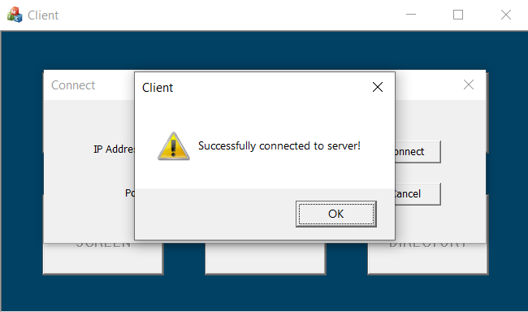

# LAN Remote Control Application

A university project for the *Computer Network* course (Semester 4, HCMUS).

This application allows a client machine to remotely control a server machine within the same LAN network. It is implemented in **C++** using the **MFC** framework and communicates via **sockets** using the **TCP protocol** at the transport layer.

## ✨ Features

- Connect to the server using an IP address and port.
- Display information about processes running on the server.
- Display information about active applications.
- Capture and view the screen of the server machine.
- Log key presses on the server machine.
- Browse the directory tree of the server machine.

  

## 🔌 Connect Server and Client

To connect the client to the server, users must enter the correct **IP address** and **port number** in the connection dialog. Below are example screenshots of the connection process:

  
  
  

### 📌 Notes on IP Address

- **Connecting between two different machines on the same network**:  
  The client must know the **IP address of the server machine**. This can be found on the server by running the `ipconfig` command in **Command Prompt**.  
  The default port number is **6666**, as pre-defined in the source code.

- **Connecting on the same machine**:  
  In addition to using the actual IP address, users can also enter the **loopback address `127.0.0.1`**. This is a special IP that refers to the local machine itself.  
  Any data sent to `127.0.0.1` will be handled internally without going through the physical network.

## 🎥 Demo Video

## 🚀 Usage

To run the application, download and run the following files:

- `Server/x64/Debug/Server.exe`
- `Client/x64/Debug/Client.exe`

Make sure both client and server are on the same local network.
