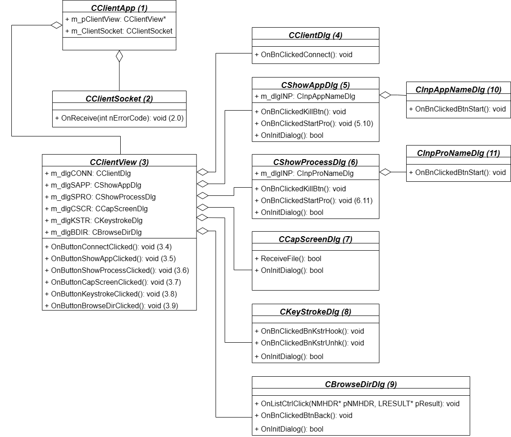
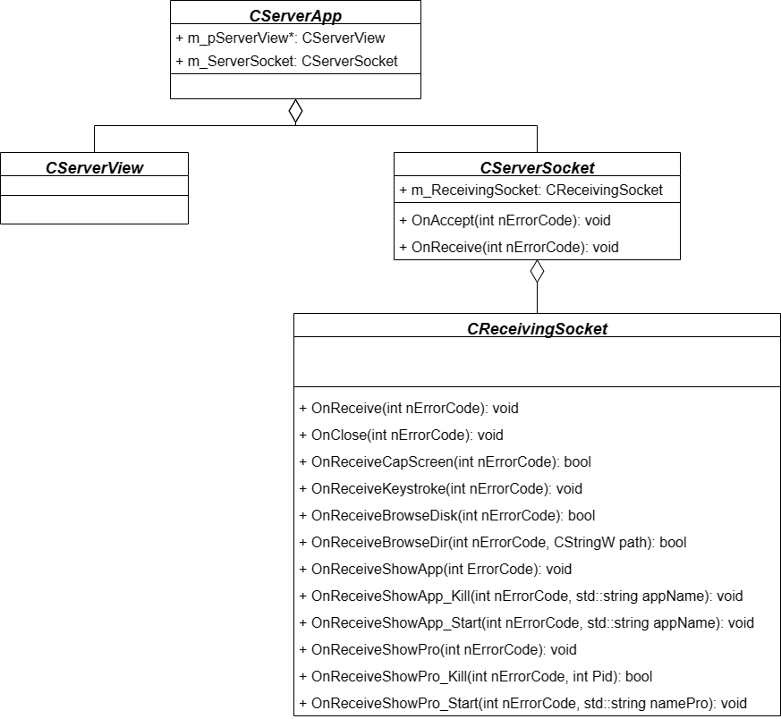
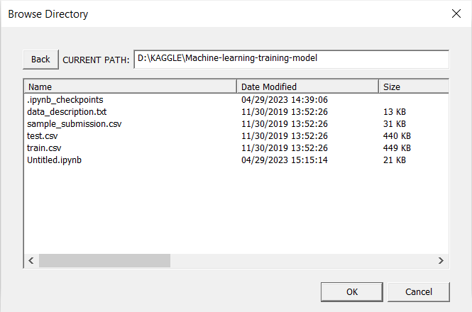
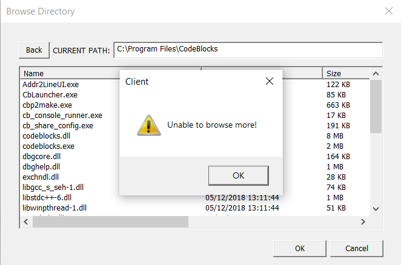
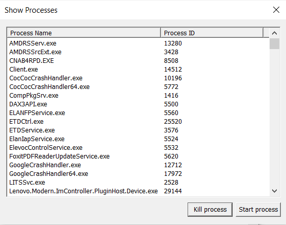
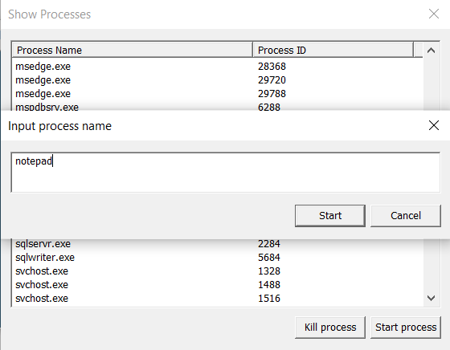
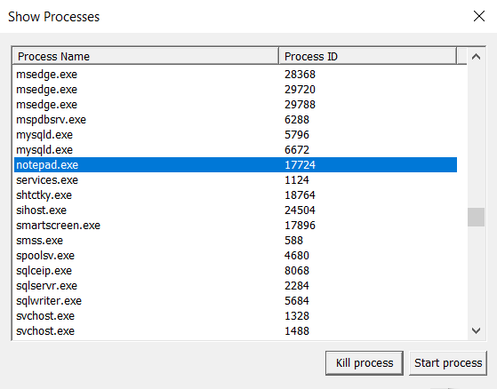
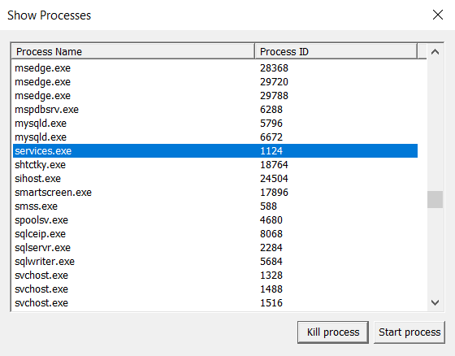
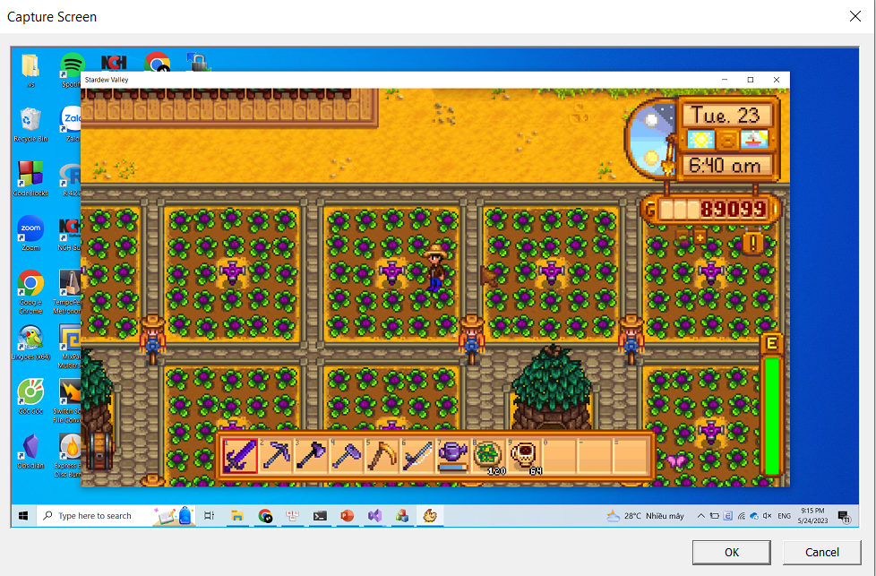
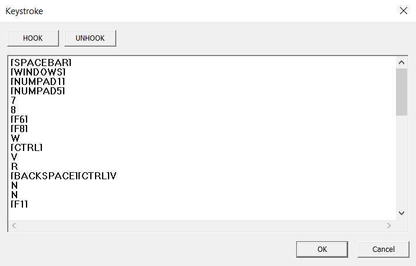

# LAN Remote Control Application
A university project for the *Computer Network* course (Semester 4, HCMUS).
This application allows a client machine to remotely control a server machine within the same LAN network. It is implemented in **C++** using the **MFC** framework and communicates via **sockets** using the **TCP protocol** at the transport layer.

You can [📄 View the project report (PDF)](report.pdf) or ▶️ [Watch demo video on YouTube](https://www.youtube.com/watch?v=bAyCufM2_0o)

<table>
  <tr>
    <td align="center">
       
      <em>Main UI</em>
    </td>
    <td align="center">
       
      <em>Client Diagram</em>
    </td>
    <td align="center">
       
      <em>Server Diagram</em>
    </td>
  </tr>
</table>

## ✨ Features
- Connect to the server using an IP address and port.
- Display information about processes running on the server.
- Display information about active applications.
- Capture and view the screen of the server machine.
- Log key presses on the server machine.
- Browse the directory tree of the server machine.

  
## 🔌 Connect Server and Client
To connect the client to the server, users must enter the correct **IP address** and **port number** in the connection dialog. Below are example screenshots of the connection process:
<table>
  <tr>
    <td align="center">
       
      <em>Connect Dialog</em>
    </td>
    <td align="center">
       
      <em>Connection Failed</em>
    </td>
    <td align="center">
       
      <em>Connection Successful</em>
    </td>
  </tr>
</table>

When connecting between **two different machines on the same local network**, the client must know the **IP address of the server**. This address can be obtained by running the `ipconfig` command in **Command Prompt** on the server machine. The default port number is **6666**, as pre-defined in the source code.

If both the client and server are running on the **same machine**, users can either use the actual IP address or simply enter the **loopback address `127.0.0.1`**. This special IP refers to the local machine itself, allowing internal communication without going through a physical network.

## 📁 Browse Server Directory
To browse the server’s file system, the client user must first click the **"BROWSE DIRECTORY"** button. This will open the *Browse Directory* dialog, which displays a table of drives, folders, and files on the server.

The table includes the following attributes for each item: **Name**, **Last Modified Time**, **Size**

<table>
  <tr>
    <td align="center">
       
      <em>Browsing</em>
    </td>
    <td align="center">
       
      <em>Failed</em>
    </td>
  </tr>
</table>

## 🧩 List, Start, and Kill Processes

This feature allows the client to monitor running processes on the server, start new processes by specifying their names, or remotely terminate selected ones.

<table>
  <tr>
    <td align="center">
       
      <em>List processes</em>
    </td>
    <td align="center">
       
      <em>Start a process</em>
    </td>
  </tr>
  <tr>
    <td colspan="2" align="center">
      
       
      <em>Kill a process</em>
    </td>
  </tr>
</table>

## 🖥️ Capture Screen

This feature allows the client to remotely capture and view the current screen of the server machine in real time.

   
  <em>Capture Server Screen</em>

## ⌨️ Keystroke

This feature allows the client to remotely capture and display all keystrokes typed on the server machine.

   
  <em>Keystroke Hooked</em>

## 🚀 Usage
To run the application, download and run the following files:
- `Server/x64/Debug/Server.exe`
- `Client/x64/Debug/Client.exe`
Make sure both client and server are on the same local network.
